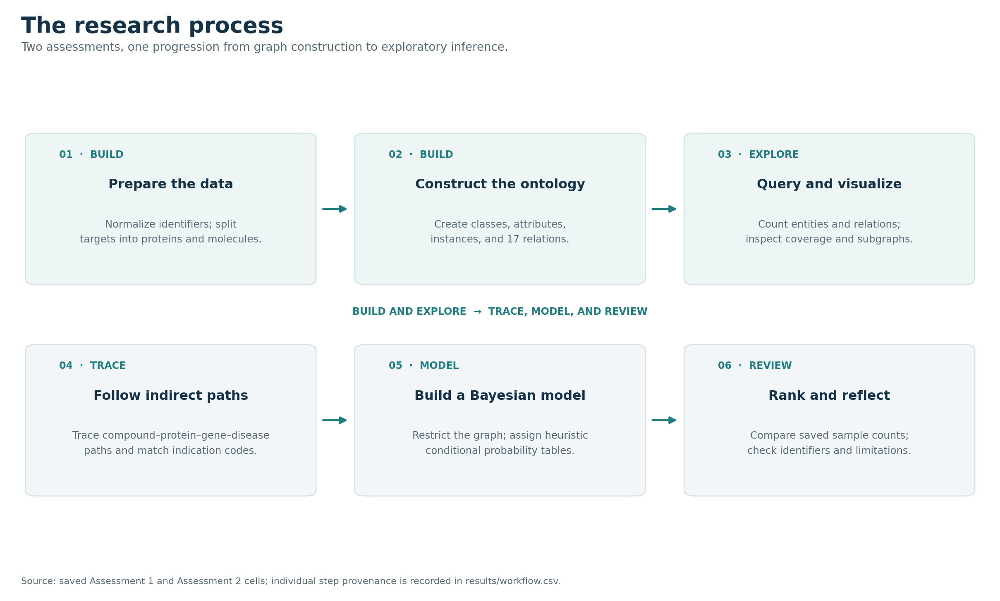
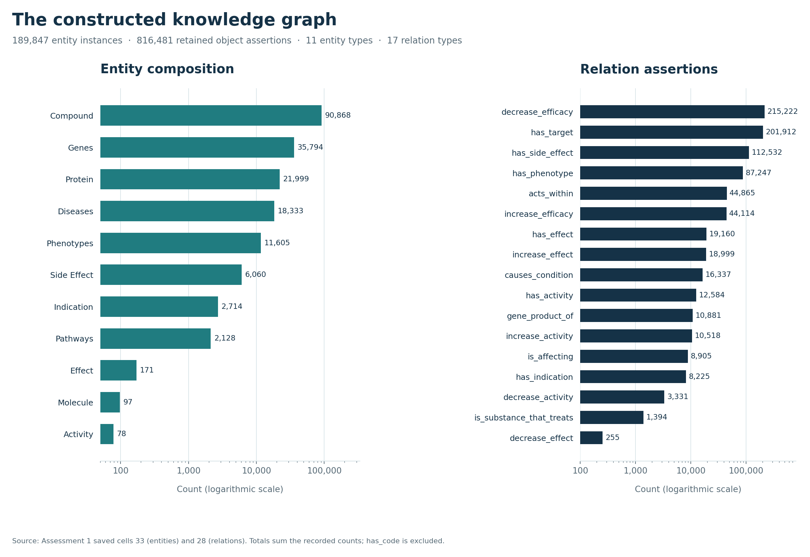
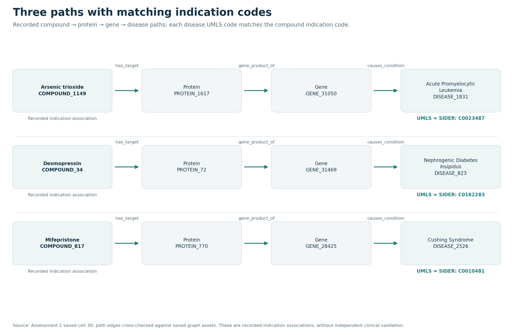
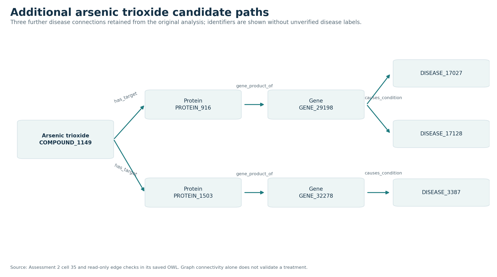
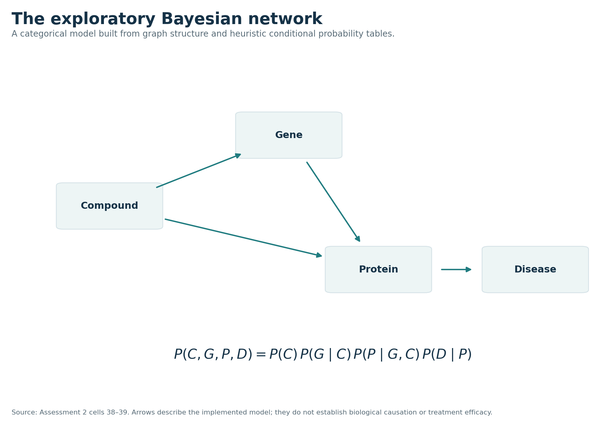
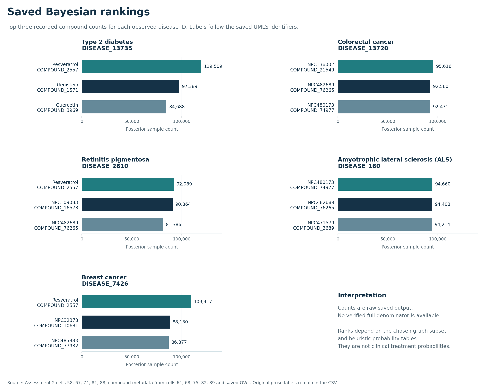

# OREGANO: from knowledge graph construction to candidate ranking

**Ibrahim Ineizeh**

*A combined Knowledge Engineering study. Original work: 2025. Archival edition: 4 October 2026.*

## Abstract

I explored how a biomedical knowledge graph can support computational drug repurposing, using the OREGANO V2.1 dataset. I first constructed an OWL representation, queried its basic properties, and inspected selected graph neighborhoods. I then searched for indirect compound–protein–gene–disease paths and used the graph structure to specify a Bayesian network. The saved results contain 189,847 asserted entity instances across 11 classes and 816,481 object relation assertions across 17 predicates. The path search returned three examples with matching disease and indication identifiers. A restricted Bayesian model ranked compounds for five disease nodes. The main finding is that the graph supports traceable candidate generation, while its coverage, identifier quality, and modeling assumptions strongly affect interpretation. This edition combines both assessments, preserves their historical outputs, and corrects errors found when checking the original discussion against the actual identifiers.

## 1. Aim and project process

Drug repurposing investigates possible new uses for existing compounds. OREGANO brings together compound, target, gene, disease, and other biomedical information in a graph designed to support this kind of computational exploration [1]. My aim was to understand the graph first, then investigate what could be inferred from its connections.

I worked in two stages. In the first stage, I loaded the entity tables and relation triples, constructed an ontology, and used SPARQL to examine the data. In the second stage, I reused that ontology to search for compounds connected indirectly to diseases and to build a probabilistic ranking model. Keeping both stages together makes the reasoning easier to follow: the later inferences depend on the representation and coverage established earlier.



*Figure 1. The process moves from data preparation to graph inspection, candidate paths, and probabilistic ranking. The final step is interpreting the limits of the evidence.*

This report distinguishes three forms of evidence: saved notebook outputs, graph assertions checked in the saved OWL file, and external identifier checks. Counts in this edition were extracted from historical outputs; they are not the result of a new end-to-end run. Original notebook cell references use zero-based indices, prefixed A1 or A2. The public notebook retains those source indices in cell metadata.

## 2. Constructing the ontology

### 2.1 Data preparation and representation

I loaded ten entity TSV files and the relation file `OREGANO_V2.1.tsv`. To make the identifiers and attribute names compatible with XML, I replaced nonalphanumeric characters with underscores and prefixed identifiers that began with a digit. Missing attribute values were filled with zero in the original implementation. This made construction straightforward, although zero then represented missingness as well as a stored value.

The `TARGET` table contained both proteins and molecules. I separated them into `PROTEIN` and `MOLECULE` by identifier prefix because their connections are different: proteins can have a `gene_product_of` link, while the molecule records do not have that relationship in this representation. This produced 11 entity classes from the ten source entity tables.

I created the classes, data attributes, entity instances, and object properties with Owlready2. I omitted `has_code` as an object relation because the codes were represented as compound attributes rather than links between two typed entity instances. Finally, I saved the ontology as `oregano.owl` and reloaded it before querying it [A1:7–23].

### 2.2 Recorded graph size

| Measure | Recorded value | Evidence |
| --- | ---: | --- |
| Source relation rows | 823,005 | A1:14 |
| Asserted entity instances | 189,847 | Sum of A1:33 |
| Entity classes | 11 | A1:8–9, 33 |
| Data attributes | 237 | A1:12 |
| Object relation predicates | 17 | A1:17, 28 |
| Retained object relation assertions | 816,481 | Sum of A1:28 |

The difference between the source row count and the retained assertion total is 6,524. The missing TSV files prevent me from independently attributing the entire difference to `has_code` or other conversion effects. I therefore report the two totals separately.

The counts describe asserted data in my constructed representation. I did not demonstrate reasoner validation. In particular, the original schema assigned two separate ranges to `has_target`, intending a protein or a molecule. Under OWL semantics, multiple ranges impose an intersection rather than alternatives [7]. Shared data-property domains have a related issue. A corrected future ontology should use an explicit union or a common superclass; this edition preserves the original construction method and records the limitation.

## 3. Exploring graph structure and coverage

I used SPARQL to count relation assertions and instances of each class. I also examined how entities participated in relations and visualized both the schema and sampled parts of the graph.



*Figure 2. Counts extracted from the saved first-stage outputs. The logarithmic scale makes both common and rare categories visible; values are printed beside the bars.*

| Entity class | Instances | Entity class | Instances |
| --- | ---: | --- | ---: |
| Compound | 90,868 | Protein | 21,999 |
| Gene | 35,794 | Disease | 18,333 |
| Phenotype | 11,605 | Side effect | 6,060 |
| Indication | 2,714 | Pathway | 2,128 |
| Effect | 171 | Molecule | 97 |
| Activity | 78 | **Total** | **189,847** |

The most frequent relation was `decrease_efficacy`, with 215,222 assertions, followed by `has_target` with 201,912 and `has_side_effect` with 112,532. The least frequent was `decrease_effect`, with 255 assertions. Direct treatment assertions were comparatively sparse: `is_substance_that_treats` had 1,394 assertions. The complete relation table is supplied in `results/` [A1:28].

The saved coverage outputs reported 29,697 compounds participating in `has_target`, compared with 435 compounds participating in a direct treatment relation. All 97 molecule instances received target links, while 6,748 of 21,999 protein instances did. This uneven coverage matters for later inference: a missing treatment edge may reflect the graph's coverage rather than an unknown or ineffective treatment.

Some original participation queries used `SELECT ?node` without `DISTINCT`. Those outputs should be read as historical query results; a rigorous distinct-entity coverage analysis should rerun explicit distinct queries. The numbers do not show that a compound is connected *only* through one relation.

### 3.1 Formalizing the relationships

I used first-order logic to describe the types of entities linked by each predicate. During consolidation, I corrected a quantifier-order error in the original discussion. The observation that every molecule has some incoming target link supports the dataset statement:

```text
For every molecule m, there exists a compound c such that has_target(c, m).
```

It does not imply that one compound targets every molecule. The same distinction applies to the original activity, effect, and pathway coverage examples. For compound interactions, I use separate variables for the two compounds rather than writing an unintended self-relation. These formulas describe the observed dataset; they are not general biological laws.

### 3.2 What the visualizations showed

I assigned colors by entity type and inspected relation-focused samples. The efficacy sample contained 1,000 displayed edges; the gene–disease sample contained 500; the general sample contained 1,500. The file originally named `knowledge_graph_full.html` was therefore a general sample, not a visualization of the whole graph. Sampling in the original code was with replacement, so displayed sample sizes do not guarantee unique assertions.

The graphs made compound-interaction chains and indirect gene–disease connections easier to inspect. For example, the methyclothiazide neighborhood contained both a dermatitis side-effect link and an increased-adverse-effect link. These are recorded connections; the graph does not establish that one causes the other. Likewise, an absent edge in a sampled visualization does not establish that the compound has no protein target or no treatment relation. The [local graph gallery](visualizations/index.html) preserves these views with explicit sample labels.

## 4. Searching for indirect compound–disease paths

I started from diseases and worked backward through genes and proteins to compounds. In the direction of the stored assertions, the path is:

```text
Compound --has_target--> Protein --gene_product_of--> Gene --causes_condition--> Disease
```

The search found 9,449 compounds on this path. Across the ontology, 435 compounds had a direct treatment link to some disease. Only 215 of those were in the path-connected set, so excluding the overlap left 9,234 compounds [A2:24–28]. The filter removed compounds with *any* direct treatment assertion, rather than testing the absence of only one candidate compound–disease pair.

I then required usable compound information and nonzero disease identifiers, and matched the disease's UMLS value to the compound indication's SIDER identifier. This returned three rows [A2:30]. The code retains genes that have disease links; the original prose mistakenly described excluding them.



*Figure 3. These paths combine graph connectivity with an exact UMLS–SIDER identifier match in the saved output. They are checks of recorded indication information, not newly established therapies.*

| Compound | Protein | Gene | Disease | Matched identifier |
| --- | --- | --- | --- | --- |
| Arsenic trioxide (`COMPOUND_1149`) | `PROTEIN_1617` | `GENE_31050` | `DISEASE_1831` | `C0023487` |
| Desmopressin (`COMPOUND_34`) | `PROTEIN_72` | `GENE_31469` | `DISEASE_823` | `C0162283` |
| Mifepristone (`COMPOUND_817`) | `PROTEIN_770` | `GENE_28425` | `DISEASE_2526` | `C0010481` |

The corresponding indication titles in the saved table were Acute Promyelocytic Leukemia, Nephrogenic Diabetes Insipidus, and Cushing Syndrome. Because these indication records already exist in the graph, recovering them shows that known indication information can coexist with a missing direct treatment assertion. It is a useful completeness check.

### 4.1 Following arsenic trioxide further

I highlighted arsenic trioxide and followed three additional disease paths in its neighborhood [A2:35]. A read-only check of the saved OWL file confirmed the following assertions and the absence of direct treatment properties on this compound:

| Compound | Target protein | Associated gene | Candidate disease node |
| --- | --- | --- | --- |
| `COMPOUND_1149` | `PROTEIN_916` | `GENE_29198` | `DISEASE_17027` |
| `COMPOUND_1149` | `PROTEIN_916` | `GENE_29198` | `DISEASE_17128` |
| `COMPOUND_1149` | `PROTEIN_1503` | `GENE_32278` | `DISEASE_3387` |



*Figure 4. Three additional disease connections checked in the saved ontology. Every arrow follows a stored assertion; therapeutic relevance is unvalidated.*

These paths answer the graph-search question by making the intermediate nodes and predicates explicit. Their direction of biological effect, usefulness, and safety were not evaluated. I keep the disease IDs here because the additional candidates were not independently identified and validated as treatment targets.

## 5. Building the Bayesian ranking model

After exploring the paths, I designed a network with compound, gene, protein, and disease variables. Each variable is categorical: its states are entity identities in the selected subset, rather than measured biological activation or disease status.



*Figure 5. The model has compound-to-gene, compound-to-protein, gene-to-protein, and protein-to-disease dependencies. The last edge is a modeling choice derived from gene-mediated graph paths.*

The joint distribution factorizes as:

```text
Pr(C, G, P, D) = Pr(C) Pr(G | C) Pr(P | G, C) Pr(D | P)
```

From the 9,234 remaining path-connected compounds, I selected those with more than 200 combined target and gene-affecting links for the model. The resulting subset contained 60 compounds, 837 genes, 2,009 proteins, and 1,190 diseases [A2:41–42]. This reduced the model size, although it favored well-connected compounds. The largest probability tensor still occupied approximately 807 MB [A2:48].

### 5.1 How I assigned the distributions

| Distribution | Original implementation |
| --- | --- |
| `Pr(C)` | Uniform over the 60 selected compounds. |
| `Pr(G \| C)` | Genes grouped by direct compound-affecting links and whether their proteins are targeted. Group masses: 0.50, 0.30, 0.15, 0.05; redistributed across nonempty groups and their members. Uniform if no genes are directly affected. |
| `Pr(P \| G, C)` | Add a compound-based distribution allocating 0.5 mass to targeted proteins and 0.5 to others, and a gene-based distribution allocating 0.4 to produced proteins and 0.6 to others; normalize the sum. Uniform components where links are absent. |
| `Pr(D \| P)` | Add weight one for each disease linked through a protein's associated genes, add a uniform component for genes without disease links, then normalize each protein column. |

These are manually specified assumptions [A2:44–50]. The original explanation said some probabilities arose from category proportions, but the code assigns fixed category masses. The protein distribution is normally an equal mixture of its two components after normalization.

The original rationale linked a weight of 0.4 to a study of plasma-protein heritability. That study concerns genetic contributions to variation across people [6]; it does not estimate this model's conditional probability of a particular protein identity. The 0.5 target weighting is likewise not a measured binding probability for the selected compounds. I therefore present these choices as heuristics, not experimentally established parameters.

### 5.2 Choosing and conditioning on diseases

I selected six high-scoring disease rows by summing `Pr(D | P)` across proteins, then excluded `DISEASE_11304` because identifying attributes were missing [A2:51–52]. That sum is a selection score; it is not the marginal disease distribution, because it omits the upstream probabilities.

For each of the five remaining disease identities, I observed the disease variable and sampled the compound, gene, and protein variables using PyMC. Each call requested 1,000,000 draws, 10,000 tuning iterations, and the historical fixed seed. The saved logs report four chains and a different tuning/draw accounting. The full inference data are not preserved, so I report the saved top-three category counts without inventing a posterior denominator.

## 6. Recorded rankings and identifier checks

The original disease descriptions were written with Gemini assistance. Checking the actual observed disease IDs and UMLS attributes exposed four mismatches. The corrected labels below are anchored to NCBI MedGen records [2–5, 8]. Nodes with multiple UMLS codes remain identified primarily by their OREGANO ID; the label reflects the checked representative concept.

| Observed node | Original discussion label | Identifier-grounded label |
| --- | --- | --- |
| `DISEASE_13735` | Adult T-cell Leukemia-Lymphoma | Type 2 diabetes mellitus (`C0011860`) |
| `DISEASE_13720` | Colorectal cancer | Colorectal carcinoma (`C0009402`) |
| `DISEASE_2810` | Sarcoidosis | Retinitis pigmentosa (`C0035334`) |
| `DISEASE_160` | Aortic stenosis | Amyotrophic lateral sclerosis (`C0002736`) |
| `DISEASE_7426` | COPD | Malignant tumor of breast (`C0006142`) |

I retain the numerical results under the identifiers the code actually used. I do not carry the original disease-specific treatment interpretations over to the corrected labels. Several unnamed NPASS compounds were also assigned guessed drug names in the original discussion; their graph attributes do not establish those identities, so they retain their NPASS identifiers here.



*Figure 6. Raw counts copied from A2:58, 67, 74, 81, and 88. Labels follow checked disease identifiers and saved compound attributes. The counts are historical ranking outputs, not treatment probabilities.*

| Observed disease node | Rank 1: compound / count | Rank 2: compound / count | Rank 3: compound / count |
| --- | --- | --- | --- |
| `DISEASE_13735` | Resveratrol / 119,509 | Genistein / 97,389 | Quercetin / 84,688 |
| `DISEASE_13720` | `NPC136002` / 95,616 | `NPC482689` / 92,560 | `NPC480173` / 92,471 |
| `DISEASE_2810` | Resveratrol / 92,089 | `NPC109083` / 90,864 | `NPC482689` / 81,386 |
| `DISEASE_160` | `NPC480173` / 94,660 | `NPC482689` / 94,408 | `NPC471579` / 94,214 |
| `DISEASE_7426` | Resveratrol / 109,417 | `NPC32373` / 88,130 | `NPC485883` / 86,877 |

Resveratrol appeared first in three of the five saved rankings. The ALS-node top three differed by only 446 counts between first and third, and the colorectal-node second and third differed by 89. Without numerical convergence diagnostics or retained posterior samples, I cannot say whether these small differences are stable. Repeated appearances may reflect graph connectivity and the specified weights rather than disease-specific therapeutic relevance.

The original ALS-node information display also swapped the second and third compounds by calling hard-coded indices in the wrong order. The table above reconciles counts with identifiers. The public notebook now uses returned ranking indices when displaying compound information, so a rerun does not rely on old category positions.

## 7. Reflection, limitations, and next steps

The most useful part of the project was moving from a large graph to explicit, inspectable paths. The ontology made it possible to query the same representation consistently, and the visualizations helped me see why separating targets and checking relation coverage mattered. The indication matches also showed that missing treatment assertions can coexist with other evidence of an indication.

The Bayesian stage made me state my assumptions, but it also showed how those assumptions can dominate the result. The weights were not fitted to outcomes, the subset favored high-degree compounds, and the model treated entity identities as categorical states. I did not evaluate predictive accuracy against held-out links or demonstrate clinical validity.

There are several practical limits to reproducibility. The original code used unordered sets to create category lists and hard-coded indices to inspect rankings. A fixed random seed alone cannot stabilize that mapping. The combined notebook sorts entity lists and displays compound information dynamically, but its saved outputs remain the historical runs. Nonsequential execution counts in the original notebook also prevent those outputs from certifying a clean run. The raw TSV files and complete posterior inference data are absent from this workspace.

The next steps are to correct the OWL domain/range semantics, audit distinct-node queries and missing-value handling, reconcile multi-code identifiers, and use stable entity mappings throughout. I would then compare the ranking model with simple connectivity baselines, assess sensitivity to the weights and degree threshold, and retain convergence diagnostics and posterior data. External compound-identity checks and independent biomedical evidence would be needed before interpreting any candidate as therapeutically useful.

## 8. Conclusion

I constructed and explored an OREGANO representation, used it to identify indirect candidate paths, and built a restricted Bayesian ranking model. Together, the two stages show a complete knowledge engineering process: preparing data, choosing a representation, querying it, inspecting connections, making modeling assumptions, and assessing the results. The findings support traceable hypothesis generation and expose gaps in graph coverage and interpretation. They do not demonstrate new treatments. Correcting the identifier errors and preserving the original result provenance make this combined account more useful as an academic record of the work.

## 9. References and acknowledgments

[1] Boudin, M., Diallo, G., Drancé, M., and Mougin, F. (2023). *The OREGANO knowledge graph for computational drug repurposing*. Scientific Data, 10, 871. [doi:10.1038/s41597-023-02757-0](https://doi.org/10.1038/s41597-023-02757-0).

[2] NCBI MedGen. *Type 2 diabetes mellitus*, concept `C0011860`. [Identifier record](https://www.ncbi.nlm.nih.gov/medgen/41523). Checked 4 October 2026.

[3] NCBI MedGen. *Retinitis pigmentosa*, concept `C0035334`. [Identifier record](https://www.ncbi.nlm.nih.gov/medgen/20551). Checked 4 October 2026.

[4] NCBI MedGen. *Amyotrophic lateral sclerosis*, concept `C0002736`. [Identifier record](https://www.ncbi.nlm.nih.gov/medgen/274). Checked 4 October 2026.

[5] NCBI MedGen. *Malignant tumor of breast*, concept `C0006142`. [Identifier record](https://www.ncbi.nlm.nih.gov/medgen/651). Checked 4 October 2026.

[6] Drouard, G., et al. (2025). *Twin Study Provides Heritability Estimates for 2321 Plasma Proteins and Assesses Missing SNP Heritability*. Journal of Proteome Research, 24(6), 2689–2697. [doi:10.1021/acs.jproteome.4c00971](https://doi.org/10.1021/acs.jproteome.4c00971). Cited to clarify the scope of the original probability rationale.

[7] W3C (2012). *OWL 2 Web Ontology Language Primer (Second Edition)*, property domain and range. [Specification](https://www.w3.org/TR/owl2-primer/).

[8] NCBI MedGen. *Colorectal carcinoma*, concept `C0009402`. [Identifier record](https://www.ncbi.nlm.nih.gov/medgen/3170). Checked 4 October 2026.

The original assessments acknowledged AI assistance for SPARQL queries, grammar and vocabulary, and understanding biomedical concepts. The second assessment explicitly used Gemini for disease and compound descriptions. Codex assisted with consolidating the report, editing language, creating publication figures, packaging code, and checking the historical outputs and external identifiers. The original notebooks and large ontology files are retained separately; this edition documents editorial corrections and does not present its outputs as a newly executed experiment.
